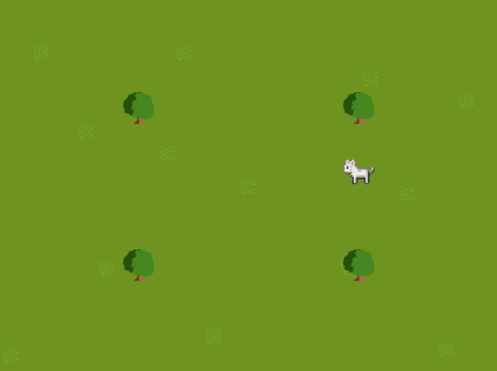

# SWEN-20003-Projects
Object Oriented Software Design projects in Java.

# SWEN20003 Projects
Across Project 1 and 2, I designed and created a simulation of a fictional universe.

# Part 1: 87.5%
In this project I created the basis of a larger simulation used in Project 2. I used the Bagel library to initially render the simulation on screen.

This included
* Read the world file, and draw the corresponding background and actors on screen
* Implement movement logic for the gatherer

# Part 2: 67%
## UML Diagram
In part 2B I designed a UML diagram for review ahead of my implementation in Project 2B.

## Part 3: 100%
Here I implemented a simulation called *Shadow Life* which features a world inhabited by creatures called *gatherers*.  Their purpose in life is to gather fruit from the trees, and deposit them at stockpiles. Once they have gathered all the fruit from their trees, they rest in front of fences.

Making their life difficult is the thief who aims to steal fruit from the stockpiles and place it in their hoards. The thief and gatherers follow rigid rules, and once they all reach their final goals (the fence), the simulation halts.

The behaviour of the simulation is entirely determined by the world file loaded when the Shadow Life program starts, including the actors, their start locations, behaviour, win requirements, and a tick timeout specified in the command line.

The code for this assignment is fully commented and uses basic Object Oriented Software Design principles.

